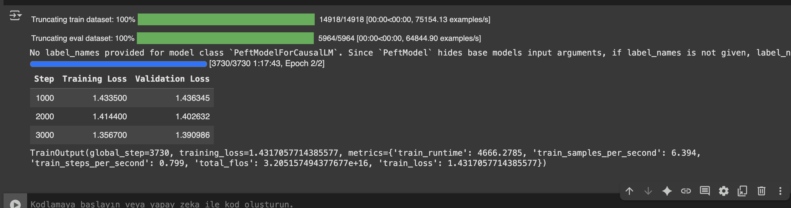
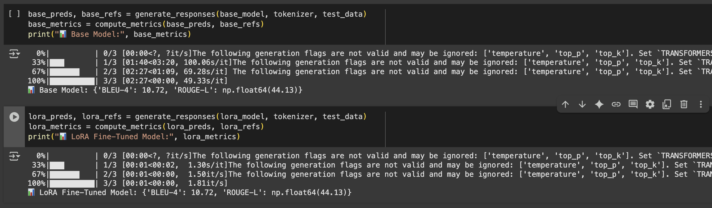
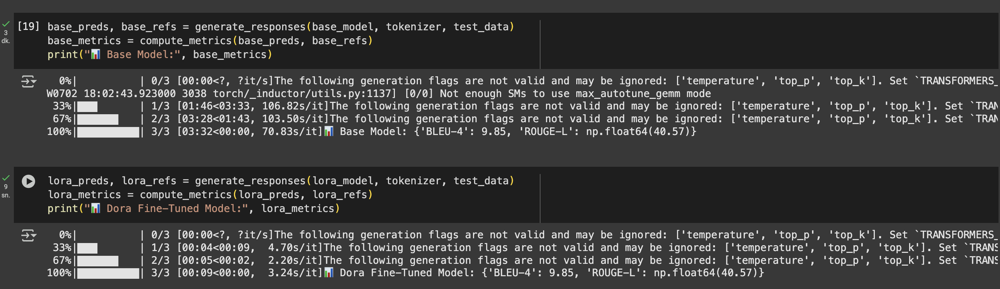
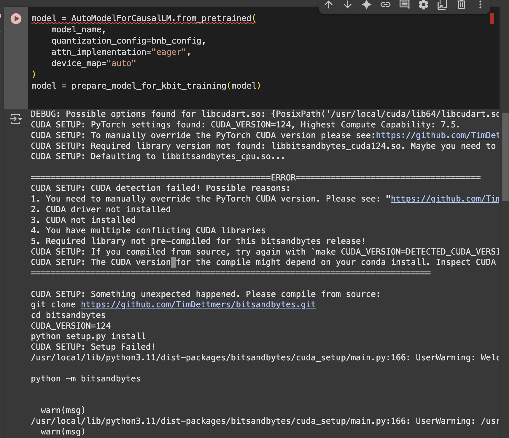

# Finetuning with LoRA & DORA – Gemma Model

This project demonstrates parameter-efficient fine-tuning (PEFT) of the [Gemma](https://huggingface.co/google/gemma-3-1b-it) model using **LoRA** and **DORA** techniques on instruction-formatted datasets. The experiments were conducted in a constrained Google Colab environment.

---

## Dataset Preparation

- Datasets were loaded from Hugging Face and converted from `.parquet` to `.jsonl`.
- A script was used to sample 5,000 training and 2,000 test examples per dataset.
- All data was structured in the **Instruction / Input / Response** format.

> See notebook: `dataset_download_and__formatting.ipynb`

---

## Techniques Used

| Technique | Quantized | PEFT Method | Model        | GPU Used | Max Length | Notes            |
|----------|-----------|-------------|---------------|----------|------------|------------------|
| LoRA     | ❌        | LoRA        | gemma-3-1b-it | T4       | 256        | Gradient Accum.  |
| DORA     | ❌        | DORA        | gemma-3-1b-it | T4       | 256        | Dropout-based    |

---

##  Training Strategy

- Mixed precision: `float16`
- Gradient accumulation: 2 (to emulate batch size 8)
- Max sequence length: 256 tokens
- Data was cached in RAM to reduce IO bottlenecks

###  Training Example

---

##  Evaluation Results

| Technique | BLEU-4 | ROUGE-L | Training Time | Peak Memory |
|-----------|--------|---------|---------------|-------------|
| LoRA      | 10.72  | 44.13   | 1.2 hrs       | 11 GB       |
| DORA      | 9.85   | 40.57   | 1.1 hrs       | 10 GB       |

###  LoRA Evaluation

###  DORA Evaluation

---

##  Colab-Specific Issues

During QLoRA setup, `bitsandbytes` failed to install due to CUDA 12.4 incompatibility.

> **Resolution**: Used standard (non-quantized) LoRA & DORA for fine-tuning instead.

---

##  Notebooks

- `dataset_download_and__formatting.ipynb` – Data conversion & sampling  
- `Lora_finetuning.ipynb` – Main training script for LoRA
- `Dora_finetuning.ipynb` - Main training script for Dora

Each script includes inference and evaluate calculation.

---

## Report

A full summary of methodology and results can be found in:

 `Finetuning_Task_Report.pdf`

---

##  Author

Prepared by **Ilgın**, July 2025.
